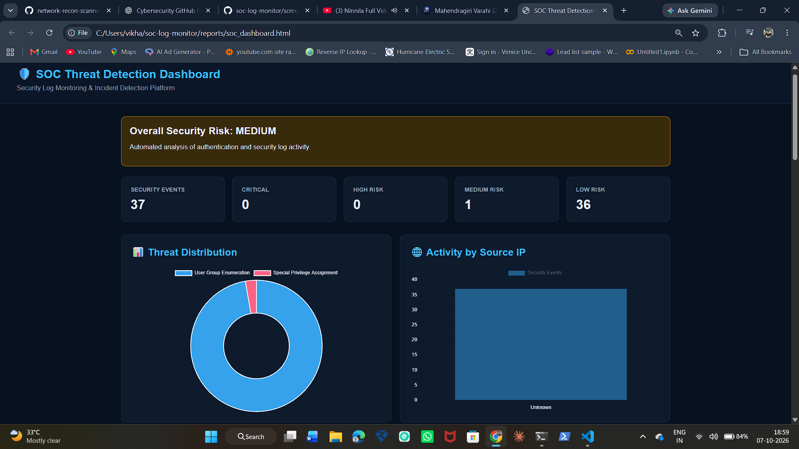

# 🛡️ SOC Log Monitoring & Threat Detection Dashboard

A Python-based Security Operations Center (SOC) project that analyzes security logs, detects suspicious activities, classifies security events by severity, and generates an interactive HTML security dashboard.

## 🚀 Features

- Security log parsing
- Threat detection
- Source IP identification
- Threat classification
- Risk severity analysis
- Automated security summary
- Interactive SOC dashboard
- Threat distribution visualization
- Source IP activity visualization
- HTML security report generation

## 🏗️ Architecture

```text
Security Logs
     ↓
Log Parser
     ↓
Parsed Events
     ↓
Threat Detection Engine
     ↓
Threat Classification
     ↓
Risk Analyzer
     ↓
SOC Dashboard
     ↓
Security Report
```

---

## ⚙️ Installation & Setup

### 1. Clone the repository

```bash
git clone https://github.com/vikhaasanandh/soc-log-monitor.git
cd soc-log-monitor
```

### 2. Create a virtual environment

```bash
python -m venv venv
```

### 3. Activate the virtual environment

**Windows PowerShell:**

```powershell
venv\Scripts\Activate.ps1
```

### 4. Install dependencies

```bash
pip install -r requirements.txt
```

### 5. Run the SOC monitoring system

```bash
python main.py
```

### 6. View the generated dashboard

After the analysis completes, open:

```text
reports/soc_dashboard.html
```

### 7. View generated reports

The project generates:

```text
reports/
├── parsed_logs.json
├── detections.json
├── risk_summary.json
├── soc_dashboard.html
└── windows_events.json
```

> ⚠️ Only analyze security logs from systems you own or have explicit permission to monitor.

---

## 🛠️ Technologies Used

- **Python** — Core programming language
- **Windows Security Logs** — Security event data
- **JSON** — Structured log and analysis results
- **HTML/CSS** — Dashboard and report interface
- **Chart.js** — Data visualization
- **Git & GitHub** — Version control and project hosting

---

## 📁 Project Structure

```text
soc-log-monitor/
│
├── detector/
│   ├── detection_engine.py
│   ├── log_parser.py
│   ├── risk_analyzer.py
│   └── windows_log_collector.py
│
├── docs/
│
├── reports/
│   ├── detections.json
│   ├── parsed_logs.json
│   ├── risk_summary.json
│   ├── soc_dashboard.html
│   └── windows_events.json
│
├── sample_logs/
│   └── auth.log
│
├── screenshots/
│   └── soc_dashboard.png
│
├── tests/
│
├── dashboard.py
├── main.py
├── README.md
├── requirements.txt
└── .gitignore
```

---

## 📊 SOC Dashboard

The project generates an interactive HTML dashboard for security monitoring and threat analysis.

### Dashboard Highlights

- Overall security risk assessment
- Total security events
- Critical, High, Medium, and Low risk classification
- Threat distribution visualization
- Source IP activity visualization
- Detected security events
- Automated security analysis



---

## 📄 Generated Reports

After running the project, the following files are generated:

- `parsed_logs.json` — Parsed security log events
- `detections.json` — Detected security events
- `risk_summary.json` — Risk severity summary
- `windows_events.json` — Collected Windows security events
- `soc_dashboard.html` — Interactive SOC security dashboard

---

## ⚠️ Disclaimer

This project is developed for educational purposes, cybersecurity learning, and authorized security monitoring.

Only analyze security logs from systems you own or have explicit permission to monitor.

---

## 👨‍💻 Author

**J. Vikhaas Anandh**

Cybersecurity Undergraduate

GitHub: https://github.com/vikhaasanandh